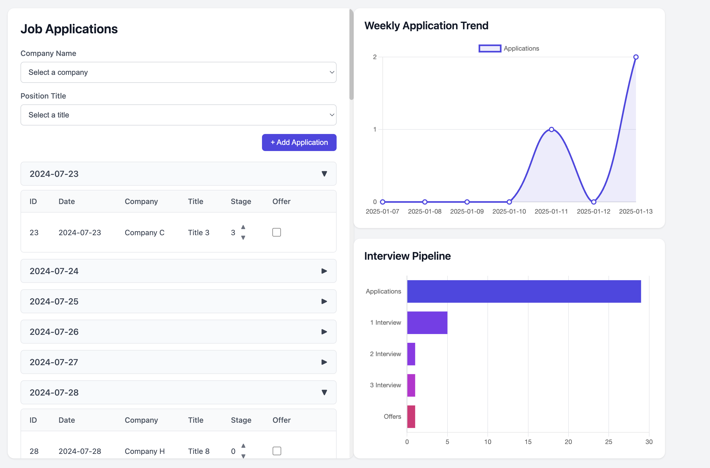
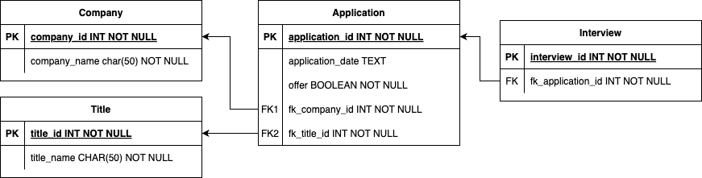

# Find A Job

Job hunting has become increasingly challenging lately. This tool is designed to help you track your job search process. Finding a job can be likened to a binomial distribution — with a low probability of success, you need to conduct multiple 'experiments.' This tool will record your applications, display the number of applications submitted in the past 7 days, and provide a funnel chart to visualize your conversion rate.


### File Structure

```
├───database/
│   └───database.db
├───sql/
│   └───schema.sql
├───static/
│   ├───css/
│   └───js/
├───templates/
│   └───index.html
├───app.py
├───db_api.py
├───init_db.py
```

The `index.html` should be divided into separate HTML, CSS, and JS files, but I'm not familiar with how to do this.

The relationships in the database are shown below.



## Running Guide

The project is primarily built using Flask and SQLite.

### Environment 

```bash
# Create a conda environment 
conda create -n find_a_job python
conda activate find_a_job

# Install external code libraries
pip install -r requirements.txt
```

### Running

```bash
python app.py
```

Then, open http://127.0.0.1:5000 in your browser.

## Acknowledgements

This project is inspired by [this video](https://youtu.be/Koh5WpuX8VA?si=NIzwT55FKwwUimPV).

Emoji graphics are from the open source project Twemoji, licensed under CC-BY 4.0. Copyright 2020 Twitter, Inc and other contributors.
